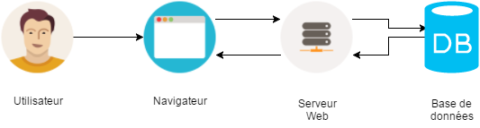
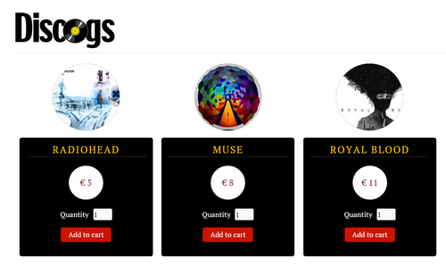
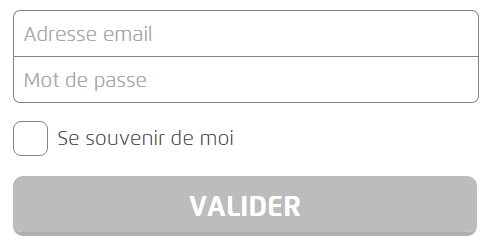

# But

* Développer un formulaire de connexion avec 3 champs (`email`, `password` et `remember me`) en HTML5
* Vérifier les données saisies en JavaScript 

# Architecture du projet



* __Navigateur__ : Permet de consulter et d'afficher le rendu du projet (Ex : Chrome, Firefox, Internet Explorer, ...)
    * _Navigateur à utiliser : Chrome_
* __Serveur Web__ : Permet de servir des requêtes respectant le protocole HTTP (Ex : [Apache HTTP](https://httpd.apache.org/), [NGINX](http://nginx.org), [Node.js](https://nodejs.org), ...)
    * _Serveur à utiliser : NGINX_
* __Base de données__ : Permet de stocker et de partager des données (Ex : [MySQL](https://www.mysql.fr), [Oracle Database](http://www.oracle.com/fr/database/overview/index.html), [MariaDB](https://mariadb.org), ...)
    * _Base de données utilisée pour conserver le panier : [Window.sessionStorage](https://developer.mozilla.org/fr/docs/Web/API/Window/sessionStorage)_

# Mise en place de l'environnement
## Récupération du projet sous Github

Git est un VCS (Version Control System). Cela permet à un groupe de développeurs (travaillant sur un même projet) de stocker toute évolution du code source.

* Double-cliquer sur `git.bat` (fichier présent sur le bureau Windows)
* Puis copié/collé la commande ci-dessous :

```
git clone https://github.com/aicfr/shopping-cart.git c:/web/html
```

### Résultat de la commande

```
c:\>git clone https://github.com/aicfr/shopping-cart.git c:/web/html
Cloning into 'c:/web/html'...
remote: Counting objects: 63, done.
remote: Compressing objects: 100% (48/48), done.
remote: Total 63 (delta 27), reused 47 (delta 11), pack-reused 0
Unpacking objects: 100% (63/63), done.
Checking connectivity... done.

c:\>
```

## Test de l'application
### Lancement de NGINX

* Double-cliquer sur `nginx.bat` (fichier présent sur le bureau Windows)
* Puis copié/collé la commande ci-dessous :

```
nginx.exe
```

* Si vous désirez stopper le serveur, double-cliquer sur `nginx.bat` (fichier présent sur le bureau Windows)
* Puis copié/collé la commande ci-dessous :

```
nginx.exe -s stop
```

### Lancement de l'application

Tester l'application : <http://localhost>



# Développement
## Formulaire de "login"
### Spécifications du formulaire

Editer le fichier `checkout.html` et ajouter le code nécessaire à la création d'un formulaire de type "login". Celui-ci devra comporter les éléments suivant :

* Un champ permettant la saisie d'une adresse email (obligatoire)
* Un champ permettant la saisie d'un mot de passe (obligatoire)
* Une case à cocher "Se souvenir de moi"
* Un bouton de validation permettant d'accéder à la page des moyens de paiement (`choose.html`)

##### Les mots clés

* HTML5
* `<form>`, `method` et `action`
* `<label>`
* `<input>` de type `email`, `password`, `checkbox` et `submit`
* `required`
* `POST`

##### Exemple



### Validation des données

Editer le fichier `checkout.html` et ajouter le bloc ci-dessous après la balise `</form>`.

Dans cette partie nous souhaitons :

* Récupérer les valeurs saisies dans les champs `email` et `password`
* Puis valider que le couple `email` / `password` existe bien (Ex : foo@foo.com / sa)

```
<script>
    var email = // Get email value ;
    var password = // Get password value ;

    var login = function () {
    // Verify login / password
    };

    email.addEventListener('change', login, false);
    password.addEventListener('change', login, false);

    var form = document.getElementById('loginForm');
    form.addEventListener('submit', function () {
        login();
        if (!this.checkValidity()) {
            event.preventDefault();
        }
    }, false);
</script>
```

##### Les mots clés

* `getElementById(...)`
* `setCustomValidity(...)`
* `if` et `else`
* `value`
* `&&`

# Installation et Configuration de NGINX

Télécharger <http://nginx.org/download/nginx-1.9.10.zip>

Puis dézipper le fichier dans `C:\opt\nginx`

## Modifier le fichier `C:\opt\nginx\conf\nginx.conf`

```
location / {
    root   c:/web/html;
    index  index.html index.htm;
   error_page 405 = $uri;
}
```

# Fichier `bat`
## `git.bat`

```
cmd /K "cd c:\"
```

## `nginx.bat`

```
cmd /K "cd c:\opt\nginx"
```
