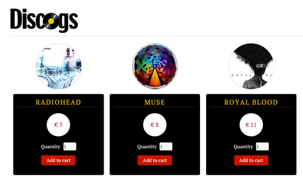
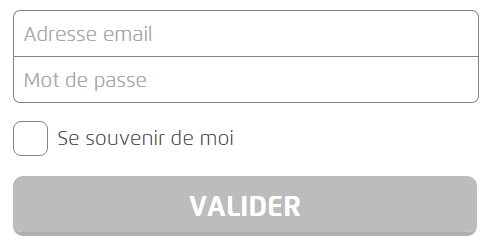

# But
# Architecture du projet


* __Navigateur__ : Permet de consulter et d'afficher le rendu du projet (Ex : Chrome, Firefox, Internet Explorer, ...)
    * _Navigateur à utiliser : Chrome_
* __Serveur Web__ : Permet de servir des requêtes respectant le protocole HTTP (Ex : [Apache HTTP](https://httpd.apache.org/), [NGINX](http://nginx.org), [Node.js](https://nodejs.org), ...)
    * _Serveur à utiliser : NGINX_
* __Base de données__ : Permet de stocker et de partager des données (Ex : MySQL, Oracle Database, MariaDB, ...)
    * _Base de données utilisée pour conserver le panier : [Window.sessionStorage](https://developer.mozilla.org/fr/docs/Web/API/Window/sessionStorage)_

# Flow du paiement
# Mise en place de l'environnement
## Récupération du projet sous Github

```
git clone https://github.com/aicfr/shopping-cart.git c:/web/html
```

## Configuration de NGINX

```
nginx.exe
nginx.exe -s stop
```

```
location / {
    root   c:/web/html;
    index  index.html index.htm;
    error_page 405 = $uri;
}
```

Tester l'application : <http://localhost>



Documentation : <http://nginx.org/en/docs/windows.html>

# Développement
## Fomulaire de "login"
### Spécifications du formulaire

Editer le fichier `checkout.html` et ajouter le code nécessaire à la création d'un formulaire de type "login". Celui-ci devra comporter les éléments suivant :

* Un champ permettant la saisie d'une adresse email (obligatoire)
* Un champ permettant la saisie d'un mot de passe (obligatoire)
* Une case à cocher "Se souvenir de moi"
* Un bouton de validation permettant d'accéder à la page des moyens de paiement (`choose.html`)

##### Les mots clés

* HTML5
* `<form>`, `method` et `action`
* `<label>`
* `<input>` de type `email`, `password`, `checkbox` et `submit`
* `required`
* `POST`

##### Exemple



### Validation des données

Editer le fichier `checkout.html` et ajouter le bloc ci-dessous après la balise `</form>`.

Dans cette partie nous souhaitons :

* Récupérer les valeurs saisies dans les champs `email` et `password`
* Puis valider que le couple `email` / `password` existe bien (Ex : foo@foo.com / sa)

```
<script>
    var email = // Get email value ;
    var password = // Get password value ;

    var login = function () {
    // Verify login / password
    };

    email.addEventListener('change', login, false);
    password.addEventListener('change', login, false);

    var form = document.getElementById('loginForm');
    form.addEventListener('submit', function () {
        login();
        if (!this.checkValidity()) {
            event.preventDefault();
        }
    }, false);
</script>
```

##### Les mots clés

* `getElementById(...)`
* `setCustomValidity(...)`
* `if` et `else`
* `value`
* `&&`