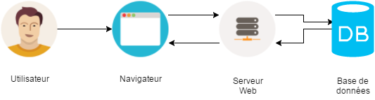

# Architecture du projet

* __Navigateur__ : Permet de consulter et d'afficher le rendu du projet (Ex : Chrome, Firefox, Internet Explorer, ...)
    * _Navigateur à utiliser : Chrome_
* __Serveur Web__ : Permet de servir des requêtes respectant le protocole HTTP (Ex : [Apache HTTP](https://httpd.apache.org/), [NGINX](http://nginx.org), [Node.js](https://nodejs.org), ...)
    * _Serveur à utiliser : NGINX_
* __Base de données__ : Permet de stocker et de partager des données (Ex : MySQL, Oracle Database, MariaDB, ...)
    * _Base de données utilisée pour conserver le panier : [Window.sessionStorage](https://developer.mozilla.org/fr/docs/Web/API/Window/sessionStorage)_

# Flow du paiement
# Développement
## Récupération du projet sous Github
## Fomulaire de "login"
### Spécifications du formulaire

Editer le fichier `checkout.html` et ajouter le code nécessaire à la création d'un formulaire de type "login". Celui-ci devra comporter les éléments suivant :

* Un champ permettant la saisie d'une adresse email (obligatoire)
* Un champ permettant la saisie d'un mot de passe (obligatoire)
* Une case à cocher "Se souvenir de moi"
* Un bouton de validation permettant d'accéder à la page des moyens de paiement (`choose.html`)

##### Les mots clés

* HTML5
* `<form>`, `method` et `action`
* `<label>`
* `<input>` de type `email`, `password`, `checkbox` et `submit`
* `required`
* `POST`

### Validation des données

##### Les mots clés

* `getElementById(...)`
* `setCustomValidity(...)`
* `value`
* `&&`